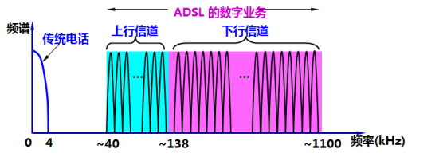

# 概述

## 计算机网络的基本概念

#### 定义

计算机网络主要是由一些**通用的**、**可编程的**硬件互连而成的，而这些硬件并非专门用来实现某一特定目的。这些可编程的硬件能够用来传送**多种不同类型**的数据，并能支持广泛的和日益发展增长的应用。

两要点一注意：

+ 多种硬件：包括计算机、智能手机、智能传感器等
+ 多种应用：包括数据、语音、视频及各种新应用
+ 可编程硬件：硬件中包含中央处理单元（**CPU**）

### 主要功能

+ 数据通信：使不同地理位置的计算机用户可以相互通信、交流信息。

+ 资源共享（信息、硬件、软件共享）：解决用户使用计算机资源**受地理位置限制**的问题，提高资源利用率

+ 分布式处理与负载均衡：将一份任务分在到同一网络中的其他计算机中，协作完成。实现**负载均衡**，提高每台计算机的可用性

+ 提高系统的可靠性：当某机出现故障，可以将任务交给网络中其他计算机完成。避免了单机无后备机情况下的通信瘫痪现象，提高系统的可靠性

## 计算机网络的发展历程

计算机技术 + 通信技术 = 计算机网络

### ABC

+ 1937年，世界第一台电子数字计算设备。**包括二进制算术、电子开关，但缺乏通用性、可变性和存储程序机制**

+ **不可编程**，只能求解线性方程组

### ENIAC

1946年，世界第一台通用电子数字计算机

### 第一代计算机网络

以**单机**为中心，除了有一台中心计算机外，其余终端都不具备自主处理的功能。

组成：主机——通信线路——终端

缺点：用户只共享一台主机中的软硬件资源、网络规模通常很小

### 第二代计算机网络（ARPANET）

+ 实现了多计算机互联

把位于**洛杉矶的加利福尼亚大学**、位于圣塔芭芭拉的**加利福尼亚大学**、斯坦福大学和盐湖城的**犹他州州立大学**的计算机主机连接，采用**分组交换技术**，通过专门的**通信交换机（接口报文处理器IMP）**和专门的通信线路互相连接。

缺点：各个厂商自己开发自己的产品，**产品之间不能通用**；各个厂商各自定制自己的体系结构，**彼此互不兼容**。

### 第三代计算机网络（OSI）

国际标准化组织（IOS）制定了**开放系统互连参考模型（OSI/RM）**，是计算机网络体系机构有了**全球统一的标准**，各厂商遵循此系统，可以使不同厂商的设备和网络互连互通。

### 第四代计算机网络

Internet是第四代计算机网络的典型代表。

### 网络发展新形态

物联网、云计算、大数据、人工智能

## 计算机网络在我国的发展

## 互联网概述

互联网（Internet），由数量极大的各种计算机网络互连起来而成的互联网络，采用**TCP/IP协议族**作为通信规则

### 基础结构

#### 第一阶段

从单个ARPANET向互联网发展的过程。1983年，TCP/IP协议成为ARPANET上的标准协议，因此所有使用TCP/IP协议的计算机都能通过互联网通信。ARPANET分为两部分：**一部分军用**，称为MILNET；**另一部分民用**，仍为ARPANET

#### 第二阶段

建成了**三级结构**的互联网，分为**主干网、地区网和校园网**

#### 第三阶段

逐渐形成了**多层次ISP**（互联网服务提供者ISP，Internet Service Provider）结构的互联网，ISP根据覆盖面积大小以及拥有的IP地址数目不同分为：**主干ISP、地区ISP和本地ISP**

> 主机A——本地ISP——地区ISP——主干ISP——地区ISP——本地ISP——主机B

### 组成

#### 核心部分

由**大量网络**和连接这些网络的**路由器**组成，为互联网边缘部分提供连通性和交换服务

+ 路由器：实现分组交换的关键部件，任务是转发收到的分组

	> 互联网核心部分采用**分组交换**技术

#### 边缘部分

由所有连结在互联网上的主机（端系统，end system）组成，这些主机供用户直接使用，用来通信和资源共享

### 端系统之间通信

主机A与主机B通信指的是A与B中的**应用程序**进行通信

#### 客户-服务器方式

+ 客户（client）和服务器（server）指的是通信中所涉及的**应用进程**
	+ 客户：被用户调用后运行，客户程序必须知道服务器程序的地址
	+ 服务器：一直不断运行着，被动等待并接受客户的通信请求，不需要知道客户程序的地址
+ 客户是服务的**请求方**，服务器是服务的**提供方**
+ 服务请求方和服务提供方都要使用**网络核心**部分提供的服务

#### 对等连接方式

两个主机通信时不区分哪一个是服务请求方，哪一个时服务提供方。本质上仍是客户-服务器方式。

### 标准化工作

+ 互联网成功因素是**开放性**和**标准化**

+ 互联网标准三个阶段：所有互联网标准都以RFC的形式在互联网上发表

	+ 互联网草案：还不是RFC
	+ 建议标准：成为RFC
	+ 互联网标准：分配编号STD xxx

	> 现在简化为建议标准、互联网标准两个阶段

## 计算机网络的类别

### 覆盖范围

+ 局域网LAN（Local Area Network）
+ 域域网MAN（Metropolitan Area Network）
+ 广域网WAN（Wide Area Network）
+ 个域网PAN（Personal Area Network）

> 若CPU距离近则称为多处理机系统，一般不叫做计算机网络

### 所有权

+ 公用网（public network）
+ 专用网（private network）

## 计算机网络的性能评估指标

#### 速率

速率指的是数据的传送速率，也称为数据率或者比特率，单位是bit/s 

速率往往是指额定速率或标称速率，并非实际运行速率

> 速率与存储容量的区别：
>
> 速率：$5 \times 10^{10} bit/s$可以记为$50Gbit/s$
>
> 存储容量：$千=K=2^{10}=1024，兆=M=2^{20}=1024K，吉=G=2^{30}=1024M$
>
> ​                   Byte（字节，基本单位），KByte（KB），MByte（MB），GByte（GB）
>
> ​                   1字节（Byte）= 8比特（bit）

#### 带宽

+ 频域：某个信号具有的频带宽度（Hz），谋鑫到允许通过的信号频带范围称为该信道的带宽
+ 时域：单位时间内信道所能通过的最高数据率（bit/s

一条通信链路的带宽越宽，其所能传输的最高数据率也越高

#### 吞吐量

单位时间内实际通过某网络的数据量。受网络的带宽或网络的额定速率限制

#### 时延

指数据从网络的一端传送到另一端所需的时间，由发送时延、传播时延、处理时延、排队时延组成。

+ 发送时延（传输时延）：从发送数据帧的**第一个比特**算起，到该帧的**最后一个比特发送完毕**所需的时间
	$$
	发送时延=\frac{数据帧长度(bit)}{发送速率(bit/s)}
	$$
	
+ 传播时延：信号再信道中需要传播一定的距离而花费的时间
	$$
	传播时延=\frac{信道长度(m)}{信号在信道上的传播速率(m/s)}
	$$
	自由空间：$3.0\times10^5km/s$
	
	铜线电缆：$2.3\times10^5km/s$
	
	光纤：$2.0\times10^5km/s$
	
+ 处理时延：主机或路由器收到分组时，**处理分组**所花费的时间

+ 排队时延：分组在路由器的**接收缓存队列**中排队等待接收的时间与在**发送缓存队列**中排队等待发送所经历的时延之和

$总时延=发送时延+传播时延+处理时延+排队时延$,，具体问题要具体分析哪种时延占据主导低位。例如高速网络链路是仅仅提高了数据的**发送速率**，而并没有提高传播速率。

> 高速链路 不等于 数据传得快

#### 时延带宽积

时延带宽积$=$传播时延$\times $带宽

表示数据链路上有多少数据在传输

#### 往返时间

+ 从发送端发送数据开始，到发送端收到来自接收端的确认，总共经历的时间

	

#### 利用率

+ 信道利用率：某信道被利用时间的百分比：$信道利用率=\frac{有数据通过时间}{（有+无）数据通过时间}$
+ 网络利用率：全网络信道利用率的加权平均值

> 信道利用率**不是越高越好**，因为信道利用率越高，根据排队论，信道会变得**堵塞**，导致时延迅速增加
> $$
> D = \frac{D_0}{1-U},U \in (0,1)
> $$
> $D_0$表示网络空闲时的时延，$D$表示当前时延，$U$表示利用率

#### 非性能指标

费用、标准化、可靠性、质量、管理和维护、可扩展性和可升级性

## 计算机网络体系结构

> 计算机网络体系结构指的是计算机网络的层次结构模型与其各层协议的集合，其指定了计算机网络该设置哪些层，同时每个层次又该提供哪些功能
>
> 层次结构是抽象的，实现各层功能的协议是具体的

### 基本概念

+ 实体：表示任何可发送或接受信息的**软件进程**或实现该层协议的**硬件单元**

+ 网络协议
	+ **语法**：规定信息格式
	+ **语义**：说明通信双方应该怎么做
	+ **定时/时序**：详细说明事件的先后顺序
	
+ 服务：网络中各层向其**相邻上层**提供的一组操作（各层向上层提供服务），下层的实体是上层实体的“服务提供者”，上层实体是下层实体的“服务用户”或“服务使用者”。

  > 服务和协议是两个不同的概念：协议是“水平”的，即协议是控制对等实体之间通信的规则；服务是“垂直”的，即服务是由下层向上层通过层间接口提供的

+ 服务访问点（SAP，Service Access Point）：同一计算机网络的不同功能层之间交换信息的接口。第$N+1$ 层实体通过第$N$层的**服务访问点**来使用第$N$层所提供的服务。

+ 服务原语：服务在形式上是由一组原语来描述的，分为：请求、指示、响应、确认。

  + 请求：源端上层实体要求服务做某项工作（源第$N+1$层实体$\rightarrow$源第$N$层实体）
  + 指示：目标端上层实体被告知某事件发生（源第$N$层实体$\rightarrow$源第$N+1$层实体）
  + 响应：目标端上层实体表示对某事件的响应（源第$N+1$层实体$\rightarrow$源第$N$层实体）
  + 确认：源端上层实体收到关于它的请求的回复（源第$N$层实体$\rightarrow$源第$N+1$层实体）

### 具有五层协议的体系结构

#### 应用层

+ 任务：通过应用进程间的交互来完成特定网络应用
+ 协议：定义的是应用进程间通信和交互的规则

#### 运输层

+ 任务：负责向两台主机中进程之间的通信提供通用的数据传输服务
+ 具有复用和分用的功能
+ 协议：主要使用传输控制协议（TCP）、用户数据报协议（UDP）

#### 网络层

+ 任务：为分组交换网上的不同主机提供通信服务
	+ 路由选择：通过一定的算法，在互联网中的每一个路由器上，生成一个用来转发分组的转发表
	+ 转发：每一个路由器在接收到一个分组时，要依据转发表中指明的路径把分组转发到下一个路由器
+ 协议：无连接的网络协议
+ IP协议分组也叫做IP数据报（数据报）

#### 数据链路层

+ 任务：实现两个相邻节点之间的可靠通信
+ 传送的基本单元是帧
+ 如果发现差错，简单的丢弃错帧
+ 可以采用可靠传输协议来纠正出现的差错

#### 物理层

+ 任务：实现比特（0、1）的传输
+ 确定连接电缆的插头应该有多少跟引脚，以及各引脚应如何连接

> 传递信息所利用的一些物理媒体，如双绞线、同轴电缆、光缆、无线信道等，并不在物理层协议之间，而是在物理层协议下面
