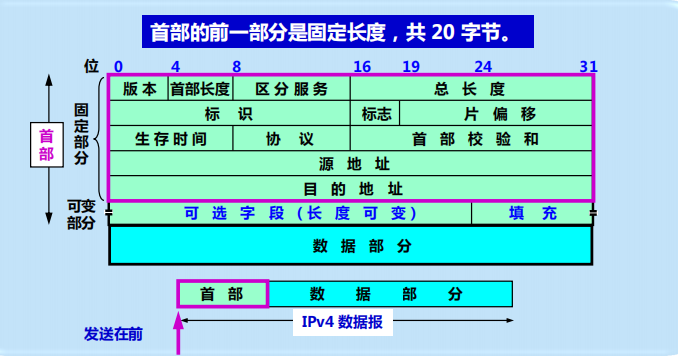
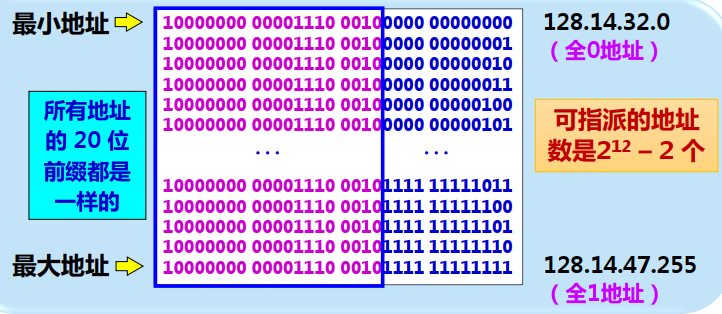
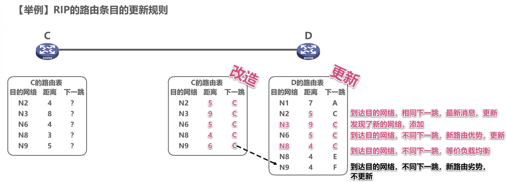
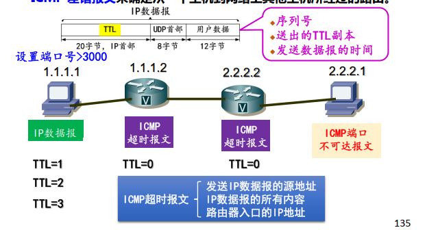
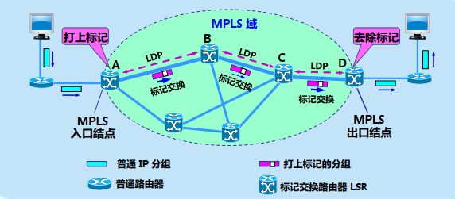

# 网络层

## 网络层概述

+ 网络层提供的两种服务：虚电路服务和数据报服务：

	

+ TCP/IP中网络层的功能：提供**不可靠**、**无连接**、**尽力而为**的数据报传送服务
	+ 寻址：能够跨越任意类型的网络对设备进行唯一寻址
	+ 路由选择：以单个IP数据报为基础，确定某个IP数据报达到目标主机需要经过哪些路由器。可以由源主机决定，也可以由IP数据报所途径的路由器决定
	+ 分段与重组：IP数据报在传输过程中所经过的物理网络帧的最大长度不同，当长IP数据报经过短帧子网时需要对其进行分段，并在目标主机处完成重组

## 网际协议（IP）

### IPv4数据报格式

IPv4数据报由首部和数据两部分组成。首部分为**固定部分**和**可变部分**，固定部分**共20字节**，是所有IPv4数据报必须有的；在首部后是可选字段，长度是可变的。

+ 版本：占4位，指IP协议的版本，IPv4或IPv6

+ 首部长度：占4位，最大可表示数值15个单位（1单位代表4字节），因此IP数据报的首部最大值是60字节。

	> 如果数据报首部的长度不是**4字节的整数倍**，必须利用最后的**填充字段**填充

+ 区分服务：占8位，用来获得更好的服务。

	+ 优先权：3字节。
	+ ToS：4字节。
	+ 未用：1字节，默认为0.

+ 总长度：占16位，首部和数据之和的长度（以字节位单位），因此数据报的最大长度为65535字节

	> 总长度必须不超过数据链路层的最大传送单元MTU
	>
	> 通过总长度字段长度 - 首部字段长度可以得到数据部分的总长度

+ 标识：占16位，是一个计数器，每发送一份报文就加1，当数据报长度超过MTU而必须分片时，标识字段会复制到所有的数据报片标志字段中，具有相同标识字段的数据报片最后可以重组为原来的数据报。

+ 标志：占3位（目前只有2位有意义）。最低为记为MF，MF=1表示后面还有分片的数据，MF=0证明是最后一个数据报片。中间位DF，DF=0时允许分片，DF=1时不允许分片。

+ 片偏移：占13位，指出数据报片在原数据报中的相对位置，以8个字节为偏移单位

	+ 每个分片的长度一定是8字节（64bit）的整数倍，最后一个分片除外

+ 生存时间：占8位，记为TTL。由源主机设置这个字段，每经过一个路由器，TTL就减1，当TTL=0时，丢弃数据报，并发送ICMP报文通知源主机。通常设置为32或64.

+ 协议：占8位，指出此数据报携带的数据使用何种协议。

	> ICMP=1、IGMP=2、TCP=6、UDP=17、OSPF=89

+ 首部校验和：占16位，用来检测首部在传输过程中是否出现差错。

	> 采用二进制反码求和：先求和、后取反；接收方得到校验和为0，表明首部在传输过程中没有出现差错
	>
	> 只检验首部的原因：首部字段会随着数据的传输发生变化，而数据部分不会

+ 源地址和目的地址：各占4字节。

+ 可选字段：长度可变，从**1字节到40字节**不等。拓展了数据包首部的功能， 内容很丰富，但也增加了路由器处理数据的开销。

  > 安全和处理限制（用于军事领域）、
  >
  > 记录路径（让每个路由器记下它的IP地址）
  >
  > 时间戳（让每个路由器都记下它的IP地址和时间）
  >
  > 宽松的源站选路（为数据报指定一系列必须经过的IP地址）
  >
  > 严格的源站选路（数据包只能通过指定的IP地址，不能经过其他地址）

+ 填充：使IP数据报首部为4字节的整数倍。IP数据报每经过一个路由器，路由器都要重新计算首部校验和，因为某些字段（生存时间、标志、片偏移等）的取值可能会发生变化。

### IPv4地址

IPv4地址是给每个连接在互联网上的主机和路由器**接口**分配一个唯一的32位标识符，必须由国际组织统一分配。由网络号和主机号两级结构组成。

> IP地址 ::= {<网络号>，<主机号>}
>
> 点分十进制记法：存在机器中的32位IP地址，每8位为一组，将8位的二进制数转为10进制后用点分开，提高可读性

+ 由于A、B、C类地址网络号和主机号所占的位数不同，其可指派的网络数和主机数也不相同。

+ 特殊的IP地址：环回接口是一种逻辑接口，允许运行在同一台主机上的客户程序和服务器程序通过TCP/IP进行通信。一般设备默认采用的环回地址为127.0.0.1
+ 

#### 子网划分

+ 在一个网络中划分更小的网络，是网络内部的事情，对外表现仍为没有划分子网的网络。

	> 划分子网从主机号借用若干位作为子网号，IP地址 ::= {<网络号>、<子网号>、<主机号>}

+ 子网划分通过子网掩码技术来区分IP地址的子网号。子网掩码是一个32bit的地址，和IP地址配合使用，不能单独存在，由一连串的0和1组成，其中值为1的比特留给网络号和子网号，值为0的比特留给主机号。

	> 子网掩码可以用与IP地址格式相同的点分十进制表示：255.255.255.0，也可以在IP地址后加“/”和1-32的数字，其中1-32的数字表示子网掩码中网络标识位的长度：192.168.0.1/24
	
+ 利用子网掩码判断通信的两台主机是否在同一网络中

  1. 将源主机的子网掩码与目标主机IP相与，得到目标主机网络号
  2. 每台主机配置TCP/IP协议时设置了本机的IP和子网掩码
  3. 判断两主机的网络号是否相同

#### 无分类域间选路（CIDR）

取消IP地址的分类结构，使用**变长子网掩码（VLSM）**进一步提高IP地址资源的利用率。

+ 网络前缀：使用各种长度的网络前缀，IP地址变为两级编址

	> IP地址 ::= {<网络前缀>,<主机号>}，网络前缀的位数不固定，可以在0~32间任意取值

	CIDR使用斜线记法，a.b.c.d/n，n表示IP地址前n位是网络前缀

	> 低位连续的0可以省略,例如10.0.0.0/10可以简写为10/10
	>
	> 网络前缀的后面加一个星号，即星号前是网络前缀，星号表示IP地址中的主机号，可以取任意值

+ 地址块：CIDR把**网络前缀**都相同的连续IP地址组成“CIDR地址块”

	> 一个地址块包含的IP地址数目取决于网络前缀的位数，例如128.14.32.0/20表示的地址块共有$2^{32-20}-2$个地址，地址块中不包含主机号全为0的网络地址，主机号全为1的广播地址

	

+ 路由聚合（构造超网）：一个CIDR地址块可以包含很多地址，这种地址聚合称为路由聚合（构造超网）

	> 使得路由表中得一个项目可以表示很多个传统分类地址的路由，减小了路由选择信息的交换
	>
	> CIDR技术汇聚的网络地址比特位必须一致
	>
	> CIDR可以看作划分子网的逆过程，划分子网使网络前缀边长，CIDR聚合地址使网络前缀缩短

	使用CIDR时，路由表中的每个项目由**网络前缀**和**下一条地址**组成，待转发数据报的目标地址可能与路由表中的**多个网络前缀相匹配**，这时要采用**最长前缀匹配**的原则选择相应路由

	> 网络前缀越长，地址块越小，包含的地址数就越少，路由就越具体

## IP选路

#### 直接交付和间接交付

+ 直接交付：当源主机和目的主机**在同一个网络**，数据报将直接交付
+ 间接交付：目的主机与源主机**不在同一个网络**，分组就要间接交付

#### 路由器

+ 任务：**连通不同的网络**，**转发分组**
+ 路由器由**软件**（操作系统）和**硬件**（CPU、内存、闪存、接口、控制端口、主板）组成
+ 路由器的每一个端口都是一个独立的广播域和冲突域

#### 路由器的结构

+ 由**路由选择处理机**和**分组处理与交换部分**组成
	+ 路由选择处理机：应用路由协议构造路由表；与相邻路由器交换路由信息不断维护路由表
	+ 分组处理与交换部分：如果收到交换路由信息的分组，则脚给路由选择处理机；若收到数据分组，则按照目标地址在转发表中查找，决定合适的输出端口
+ 可以将网络层抽象为数据层面和控制层面

> 数据层面：每个路由器**独立工作**，根据收到的IP数据报目的地址，按照**转发表转发**至下一路由器
>
> 控制层面：运行**路由选择协议**，**生成路由表**，需要路由器间**相互协作**，交换路由信息

#### 输入端口处理与输出端口处理

+ 每个输入、输出端口由三个模块组成，分别对应物理层、数据链路层和网络层。

+ 物理层模块完成比特流的接受与发送；数据链路层模块完成帧拆帧和封装帧；网络层模块处理IP数据头

	

#### 交换结构

+ 存储器
+ 总线
+ 互联网络

#### 路由选择和转发的区别

+ 路由选择：根据路由选择算法和网络的拓扑结构，**动态地**构造路由表；涉及到**很多路由器**；路由表根据路由选择算法得出；包含目的地址，下一跳地址等
+ 转发：根据转发表将用户的IP数据报从合适端口转发；**仅涉及一个路由器**；转发表根据路由表形成；

#### 路由表

包含：目的IP地址、下一跳IP地址、**标志**、为数据包传输指定的网络接口

#### IP路由选择顺序

1. 主机路由：搜索路由表，寻找能与目的IP地址完全匹配的（**网络号和主机号都匹配**）的表目

2. 网络路由：寻找能与**目的网络号**相匹配的表目

3. 默认路由：寻找标为“**默认**”的表目

## 路由选择协议

+ 路由选择协议属于**网络层**控制层面的内容
+ 不存在**最佳路由**，只能求出较为合理的选择
+ 路由选择非常复杂，是网络中所有节点共同协调工作的结果，且路由选择的环境不断变化

### 路由算法分类

+ 静态路由选择策略
	+ 非自适应路由选择
	+ 不能及时适应网络状态的变化
	+ 简单，开销较小
	+ 适用于简单的小网络
+ 动态路由选择策略
	+ 自适应路由选择
	+ 能较好地适应通信量和网络拓扑的变化
	+ 实现较为复杂，开销较大
	+ 适用于较复杂的网络

>  动态选路协议用于路由器之间、相邻路由器之间的通信
>
> 路由器上名为路由守护程序的进程运行选路协议，与相邻路由器通信，更新路由表

### 分层的路由选择协议

+ 把互联网分成许多小的**自治系统AS**，采用**分层**的路由选择协议：**域内路由选择**、**域间路由选择**

> 分层原因：互联网规模非常大，导致路由表非常大，处理时间长，且路由表交换信息会使通信链路饱和；保密

## 域内路由选择

### 开放最短路径优先协议（OSPF）

+ 开放指的是OSPF协议不受某一厂商控制，而是**公开发表**

+ OSPF基于Dijkstra最短路径算法**SPF**

+ OSPF可以直接使用**IP数据报**传送，因为其构成的数据报很短

	

#### OSPF相关概念：

+ **相邻路由器**：两台通过一条普通连路相连、可以对话的路由器

+ **相邻关系**：两台相邻路由器的双向关系

	> **是邻居不一定就有相邻关系**

+ **链路状态数据库（LSDB）**：全网络的拓扑结构图，在全网范围内是一致的

+ **链路状态广播（LSA）**：每台路由器根据自己周围的网络拓扑结构生成LSA，再发送给网络中其他的路由器，所有的LSA放在一起组成了LSDB

+ **区域**：OSPF 将一个自治系统划分为两种不同的区域——**主干区域**和**非主干区域**，每一个区域都有一个 32 位的区域标识符（用点分十进制表示）。主干区域0.0.0.0，用来连通其他下层区域。

	>**优点：减小了网络上的通信量；减少了需要维护的状态数量**
	>
	>缺点：交换信息的种类增多了；OSPF协议更加复杂

	

#### OSPF三个要点：

1. 采用**洪泛法**向本自治系统中所有路由器发送消息

	> 洪泛法：路由器将收到的消息会转发给所有端口，最后网络中所有的路由器都会同步网络链路状态信息，但这会加大网络中的通信量

2. 发送与本路由器**相邻**的所有路由器的链路状态（仅是路由器所知道的部分信息），即说明本路由器和哪些路由器相邻，以及该链路的度量（费用、距离、时延、带宽等）

3. 当链路状态**发生变化**时，路由器才采用**洪泛法**发送消息

#### OSPF报文类型

+ 问候报文（HELLO）：发现邻居，邻居保持
+ 数据库描述报文（DD报文）：向邻居发送链路状态摘要信息
+ 链路状态请求报文（LSR报文）：向邻居请求自己没有的链路状态信息
+ 链路状态更新报文（LSU报文）：用洪泛法对全网更新链路状态
+ 链路状态应答报文（LSAck报文）：向第1个发送更新的路由器发送确认

#### OSPF基本操作

确认可达性——同步链路状态数据库——更新链路状态

+ 两个相邻路由器每个10s交换一次Hello报文，确认是可达的
+ 若40s没收到Hello报文，则认为不可达，立即修改LSDB，重新计算路由表
+ 每个一段时间，路由器刷新一次数据库中的链路状态

### RIP

RIP使用**跳数**作为度量来衡量到达目的网络的距离

+ 路由器到直达网络的距离定义为1
+ 网络道非直连网络的距离定义为所经过路由器数+1
+ 允许一条路径最多只能包含15个路由器，当距离等于16时，则认为不可达
+ RIP认为好的路由就是**距离短**的路由，也就是通过路由器数量最少的路由
+ 当到达同一目的网络有多条距离相等的路由时，可以进行**等价负载均衡**
+ 三个要点：1.仅和相邻路由器交换信息 2.交换的是各自路由表的信息 3.周期性交换信息

#### RIP路由条目的更新规则：

#### RIP存在的问题

+ 限制最大距离为15

+ 当路由表发生变化时就立即发送更新报文，不是周期性发送

+ 让路由器记录收到某特定路由信息的接口，而不让同一路由信息再通过此接口反方向传送

### 域间路由选择

#### BGP

## 互联网控制报文协议（ICMP）

#### ICMP设计的必要性

+ IP提供**无连接、尽力而为**的数据报传送服务，没有提供检验或跟踪机制，不能解决网络底层的数据报丢失、重复、延迟或乱序等问题。
+ TCP在IP基础上建立**面向连接服务**解决以上问题，但**不能解决**因网络故障或其他原因而无法传输数据包的问题
+ ICMP设计的本意是在IP**数据包无法传输时提供报告**

#### ICMP的重要性

ICMP是TCP/IP协议的子协议，属于**网络层**协议，在**路由器**和**主机**之间传递控制消息

> 控制消息指网络不通、主机是否可达、路由是否可用等**网络本身**的消息。虽然不传递用户数据，但是对用户**数据传递**和**网络安全**具有极其重要的意义

#### ICMP报文格式

+ ICMP前4字节是统一格式
+ 共有三个字段：**类型**、**代码**和**校验和**
+ 紧接着4字节的内容与ICMP的类型有关

#### ICMP报文类型

+ 差错报文：路由器或目的主机处理IP数据报遇到的问题，包含目的不可达、源站抑制、超时、参数问题、重定向等

	ICMP差错报文弥补了IP协议不可靠问题：

	+ **发现错误的设备只向源主机报告差错**
	+ 只报告差错，不纠正差错
	+ 差错报文作为一般数据传输，不享受高优先级和可靠性
	+ 产生ICMP差错报文的同时会丢弃出错的IP数据报

	不应发送ICMP差错报文的几种情况：

	+ ICMP差错报文本身不会产生ICMP差错报文
	+ 广播或组播数据报不会产生ICMP差错报文
	+ 分片的IP数据报只有第一个分片会产生ICMP差错报文
	+ 特殊地址0.0.0.0和127.0.0.1的报文不产生ICMP差错报文

+ 查询报文：帮助网络管理员从一个路由器或主机得到特定信息，包含回显请求/应答报文，时间戳请求/应答报文，地址掩码请求/应答报文

#### ICMP典型应用

+ Ping程序：

  + 作用：侦测另一台主机是否可达

  	> 1. **ping 127.0.0.1**检查本地的TCP/IP协议是否运行正常
  	> 2. **ping本机IP地址**，检查本机的IP地址设置和网卡安装配置是否有误
  	> 3. **ping本网网关或本网IP地址**，检查硬件设备是否有问题，也可以检查本机与本地网络连接是否正常
  	> 4. **ping远程IP地址**，检查本网或本机与外部的连接是否正常

  + 原理：使用**ICMP回显请求/应答报文**。发送类型字段为8的回显请求报文，收到请求的主机返回类型字段为0的回显应答报文

    > 返回信息：
    >
    > **Request Timed Out**：所经过路由器的路由表中具有到达目的主机的路由，但目的主机因为其他原因不可达；
    >
    > **Destination Host Unreachable**：路由表中没有连接到目标主机的路由。

  + **没有通过**运输层TCP或UDP

+ Traceroute程序：

	+ Windows系统：tracert；UNIX系统：traceroute

	+ 作用：对路由信息进行**跟踪**，显示IP数据包从本地主机到目的主机所经过的路径

	+ 原理：使用IP首部的**生存时间（TTL）**、**ICMP差错报文、ICMP端口不可达报文**来确定路径
	
		> ICMP差错报文：中间路由
		>
		> ICMP端口不可达报文：终点
		
		

## 多协议标记交换（MPLS）

#### MPLS概述

+ 三层“转发”需要解封获取三层地址（软件实现，速度慢）；网络很大时，查找路由表花费时间；
+ 二层交换直接使用硬件转发（速度快）
+ **多协议**：表示MPLS上层支持多种协议；下层可以使用多种数据链路层协议
+ **标记**：每个数据报被打上一个标记，标记交换路由即根据标记转发，实现数据报的快速转发
+ **交换**：转发时不再升到第三层查找路由表，而是根据标记在第二层用**硬件**转发
+ MPLS没有取代IP，而是作为**IP增强技术**

#### 基本原理

+ MPLS域中有许多彼此相邻的**标记交换路由器LSR**
+ LSR具有**标记交换**和**路由选择**两种功能：标记交换功能为了**快速转发**，但这之前要使用**路由选择功能构造转发表**
+ MPLS域中各LSR使用**标记分配协议LDP**交换报文，并**找出和特定标记相对应的路径**，即**标记交换路径LSP**
+ MPLS入口处，**入口节点**为每一个IP数据报打上**固定长度标记**；出口节点**去除标记**
+ LSR通过**硬件进行转发**，**即标记交换**
